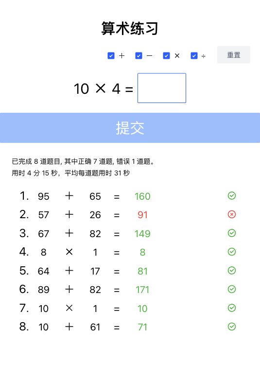

# Kid Math - 儿童算术练习

[](https://opensource.org/licenses/MIT)

小学一年级算术练习应用，支持 100 以内加减法、个位数乘法、表内除法练习。给孩子练习心算使用。

## 功能特性

- 🧮 随机生成算术题目，支持加法、减法、乘法、除法四种运算任意组合
- ✅ 即时判断答案对错，给出语音反馈和动画效果
- 📊 统计答题数量、正确率、总用时、平均用时
- 💾 答题历史自动保存到 localStorage
- 🔊 语音朗读鼓励反馈（使用浏览器原生语音合成）
- 📱 响应式设计，支持手机和平板

## 快速开始

### 开发（离线可用）

```bash
npm install
npm run dev
```

打开 http://localhost:8080 即可使用。开发模式使用本地资源文件，完全离线可用。

### 构建（用于部署）

```bash
npm run build
```

构建会自动将本地资源引用替换为 CDN 链接，输出到 `dist/kid-math.html`，可以直接部署。

### 独立全资源构建（完全离线）

```bash
npm run build:standalone
```

输出到 `dist/standalone/kid-math.html`，**所有 JavaScript/CSS 资源已内联到单个 HTML 文件**，不需要网络即可完全离线运行。适合分享给他人离线使用。

## 项目结构

```
kid-math/
├── index.html              # 开发版本，使用本地资源
├── dist/
│   ├── kid-math.html      # CDN 构建产物，使用 CDN 资源（小巧，需要网络）
│   └── standalone/
│       └── kid-math.html  # 独立构建产物，所有资源内联（完全离线可用）
├── scripts/
│   ├── build.js            # CDN 构建脚本：本地引用 → CDN 替换
│   └── build-standalone.js # 独立构建脚本：所有资源内联 → 压缩混淆
├── CLAUDE.md               # Claude Code 项目指南
├── README.md              # 项目说明
└── package.json
```

## 工作流

**开发阶段**：`index.html` 引用 `node_modules` 中的依赖，`npm install` 后支持完全离线开发。

**两种构建输出**：

| 命令                       | 输出                            | 用途                      | 大小   |
| -------------------------- | ------------------------------- | ------------------------- | ------ |
| `npm run build`            | `dist/kid-math.html`            | CDN 部署，依赖从 CDN 加载 | ~17KB  |
| `npm run build:standalone` | `dist/standalone/kid-math.html` | 离线分享，所有资源内联    | ~2.9MB |

选择适合你用途的构建输出。

## 技术栈

- Vue 3 (CDN / 本地)
- Arco Design Vue (UI 组件库)
- Day.js (时间处理)
- ECharts (统计图表)
- Animate.css (动画效果)

## 截图

**v1.1.0 (最新)** - 支持四种运算，显示答题历史：



## 许可证

MIT
